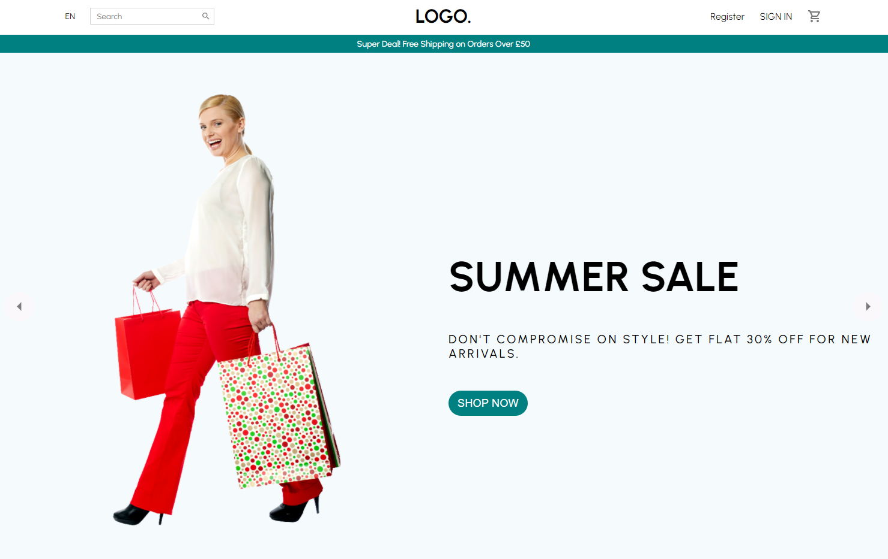

# e-commerce-client

## Welcome! 👋

LOGO-ESHOP is a fullstack e-commerce web app built with the MERN stack (MongoDB, Express, ReactJS and NodeJS). This is the client side of the e-commerce web app.

## Build with ⚙️

This is the client side of the e-commerce web app. The client side is built with ReactJS, styled with styled-components. Online payments are handled with stripe.js. All data are stored in MongoDB and are fetched from my server built with Express.

## Screenshots 📷

## Link 🔗

[Click Me!](https://logo-eshop.netlify.app/)
